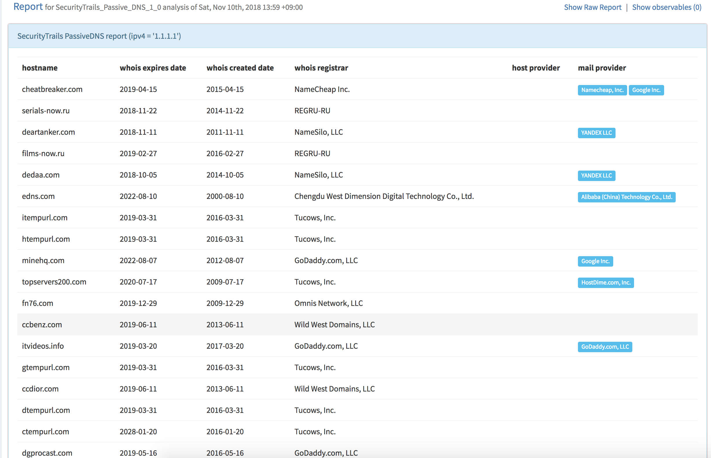
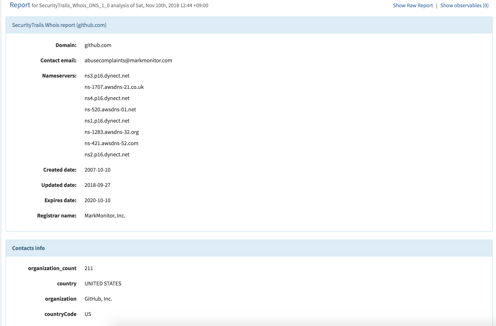

# Cortex analyzer for SecurityTrails

Cortex analyzer for SecurityTrails.

This repository contains 2 Cortex Analyzers.

- SecurityTrails_Passive_DNS:
  - SecurityTrails Passive DNS Lookup by using `https://api.securitytrails.com/v1/domains/list`.
- SecurityTrails_Whois_DNS:
  - SecurityTrails Whois Lookup by using `https://api.securitytrails.com/v1/domain/hostname/whois`.

## How to install

- Copy `./analuzers/SecurityTrails` directory to `/path/to/analyzers/`.
- Run `pip3 install -r requirements.txt`.
- Set templates(`thehive-templates/**/*.html`) via TheHive Web UI.

## Example images

**SecurityTrails_Passive_DNS:**

**SecurityTrails_Whois_DNS:**

